<div align="center">
  <h1>
    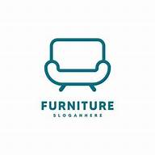<br/>
    Flutter Furniture App
  </h1>
  <h3>A Modern Furniture Shopping Application with Clean UI</h3>
</div>

<p align="center">
    <a href="https://github.com/jamalihassan0307/" target="_blank">
        
    </a>
    <a href="https://www.linkedin.com/in/jamalihassan0307/" target="_blank">
        
    </a>
</p>

## 📌 Overview

A beautifully designed Flutter application for furniture shopping with a modern and clean UI. The app features smooth animations, intuitive navigation, and a seamless shopping experience.

## 🚀 Tech Stack

- **Flutter** (UI Framework)
- **Provider** (State Management)
- **Custom Animations**
- **Material Design**

## 🔑 Key Features

- ✅ **Category Filtering**: Browse furniture by categories
- ✅ **Shopping Cart**: Easy cart management
- ✅ **Search**: Find furniture quickly
- ✅ **User Profile**: Personalized user experience
- ✅ **Product Details**: Detailed information about each item
- ✅ **Responsive Design**: Works on all screen sizes
- ✅ **Custom Navigation**: Smooth page transitions
- ✅ **Modern UI**: Clean and attractive interface

## 📸 Banner

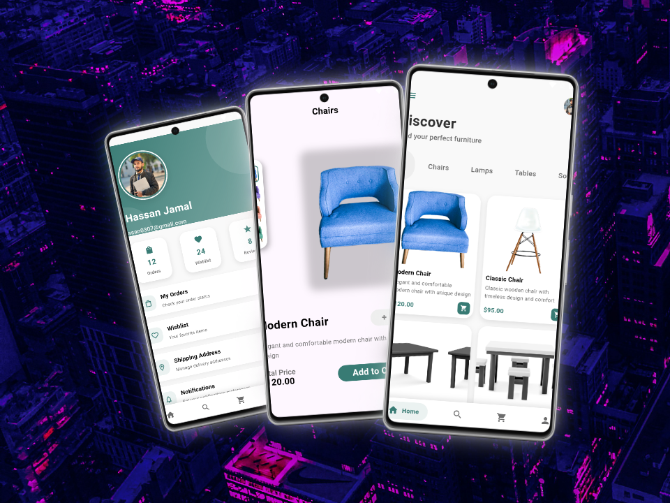

## 📸 Screenshots

### Main Features

<table border="1">
  <tr>
    <td align="center">
      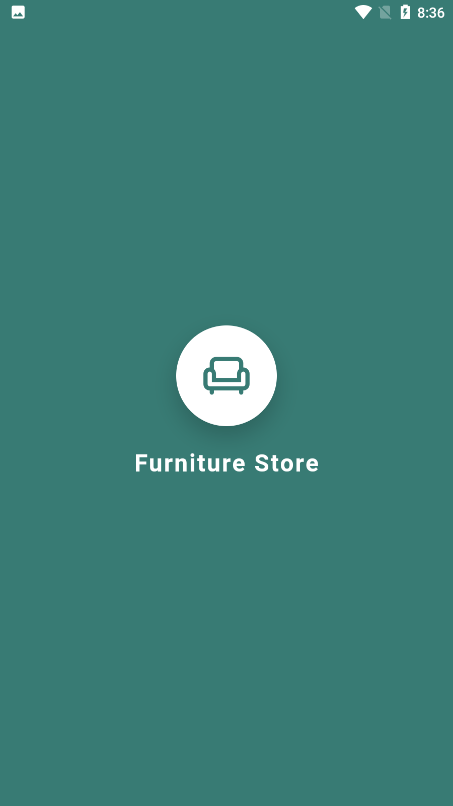
      <p><b>Splash Screen</b></p>
    </td>
    <td align="center">
      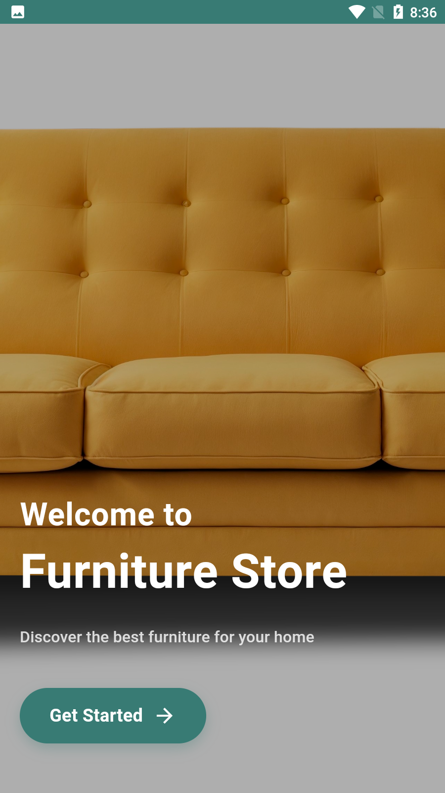
      <p><b>Welcome Screen</b></p>
    </td>
    <td align="center">
      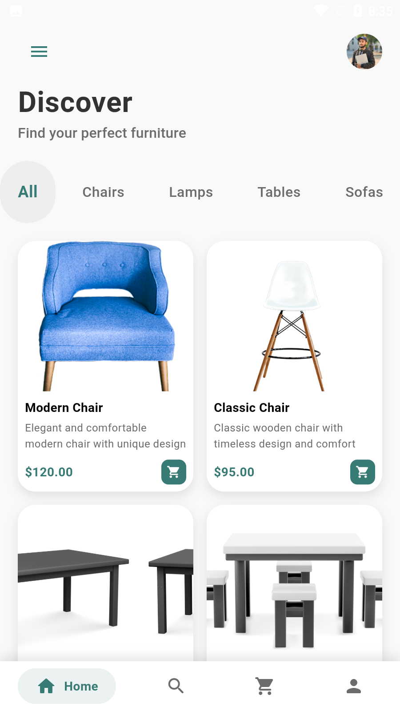
      <p><b>Home Screen</b></p>
    </td>
  </tr>
  <tr>
    <td align="center">
      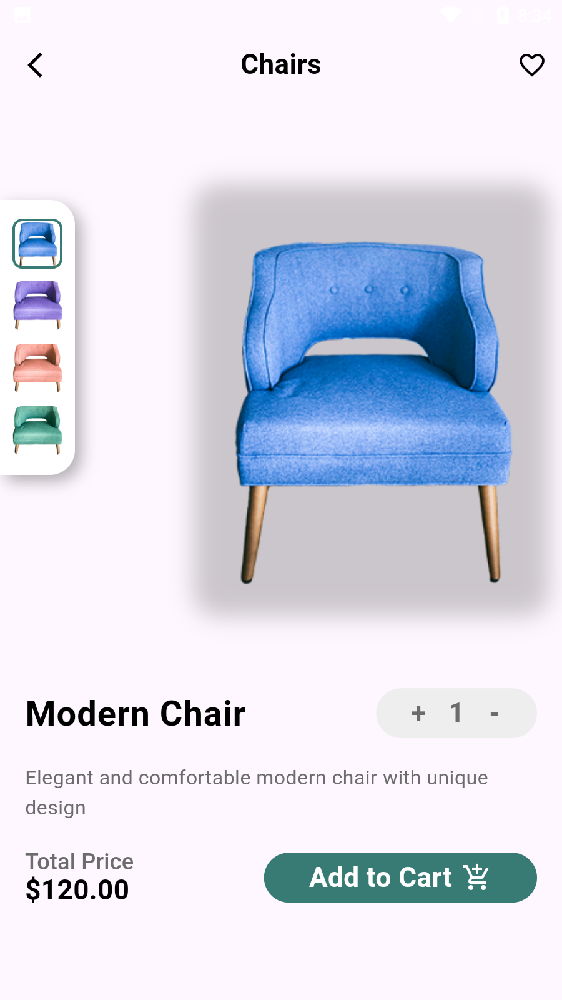
      <p><b>Product Details</b></p>
    </td>
    <td align="center">
      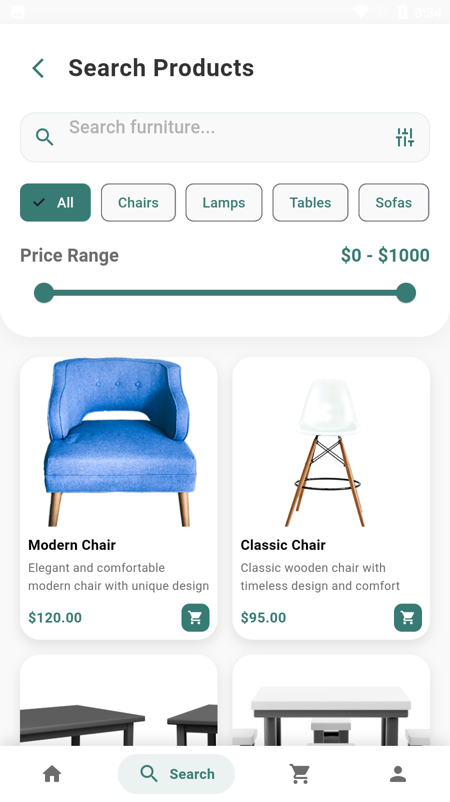
      <p><b>Search & Filter</b></p>
    </td>
    <td align="center">
      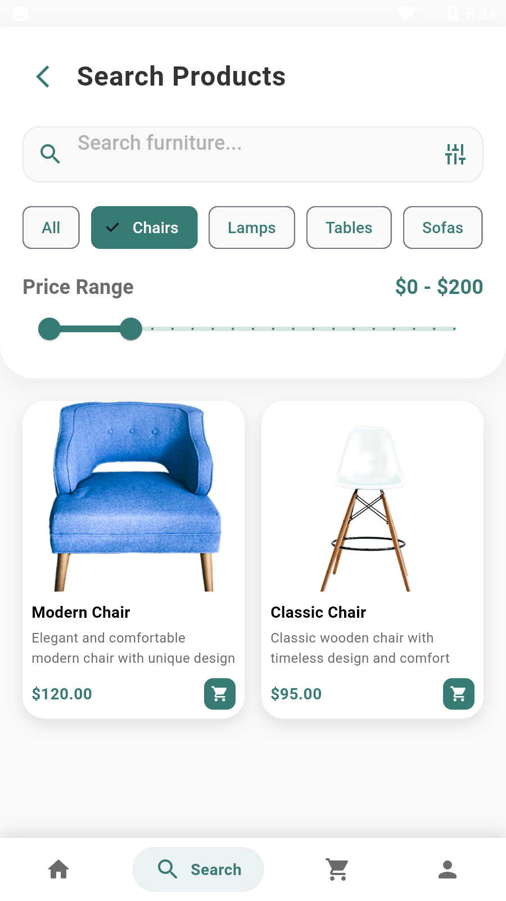
      <p><b>Filter Results</b></p>
    </td>
  </tr>
</table>

### Cart & Navigation

<table border="1">
  <tr>
    <td align="center">
      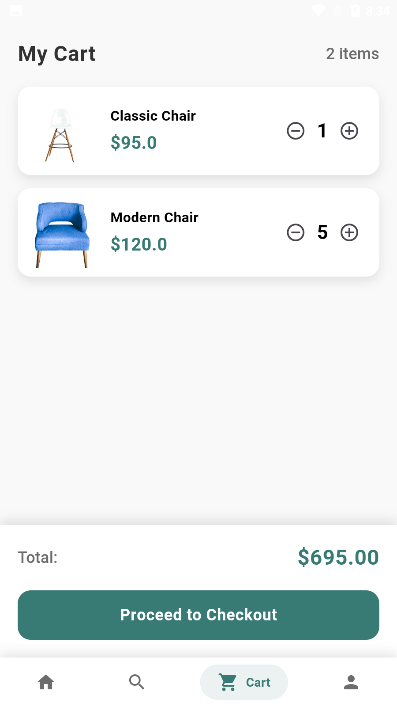
      <p><b>Shopping Cart</b></p>
    </td>
    <td align="center">
      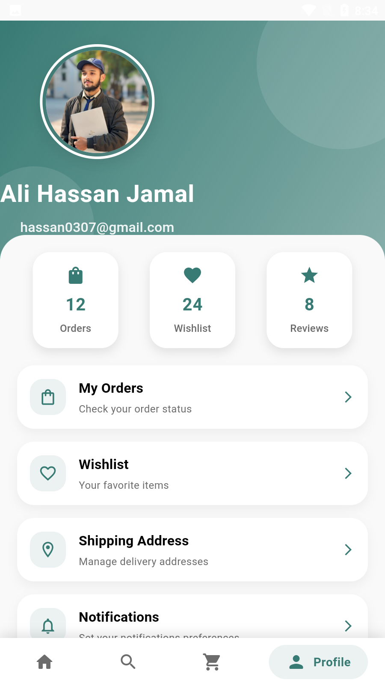
      <p><b>User Profile</b></p>
    </td>
    <td align="center">
      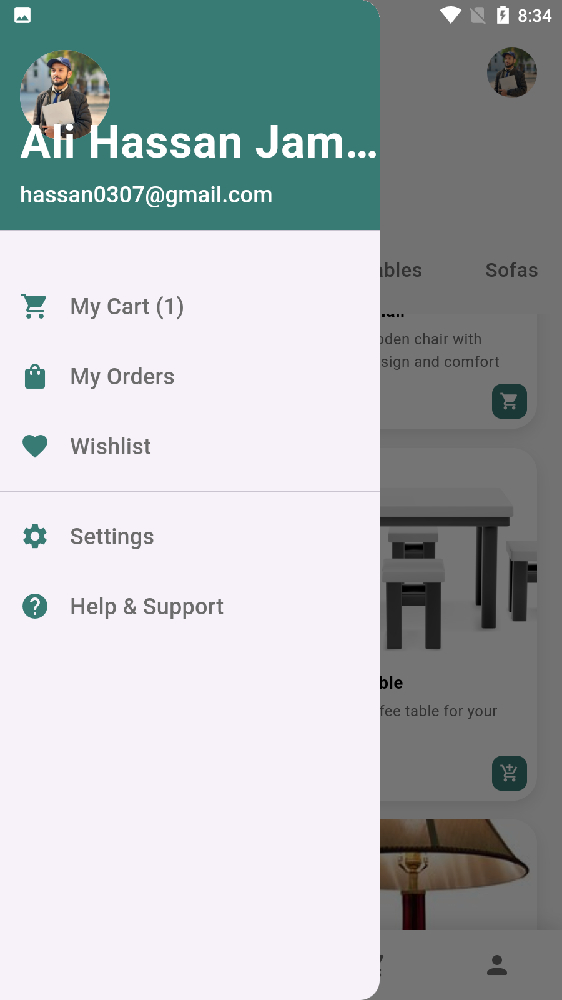
      <p><b>Navigation Drawer</b></p>
    </td>
  </tr>
</table>

## 📁 Project Structure

```lib/
├── core/
│ ├── color.dart
│ ├── space.dart
│ └── text_style.dart
├── data/
│ └── model_data.dart
├── model/
│ ├── cart_model.dart
│ └── model.dart
├── page/
│ ├── cart_page.dart
│ ├── details_page.dart
│ ├── home_page.dart
│ ├── profile_page.dart
│ ├── search_page.dart
│ └── splash_page.dart
├── widgets/
│ ├── Custom_app_bar.dart
│ ├── bottom_nav_bar.dart
│ ├── drawer_page.dart
│ ├── grid_item_card.dart
│ └── tabbar_button.dart
└── main.dart
```

## 📱 Download APK

You can download the latest version of the app from:
[APK/app-armeabi-v7a-release.apk](APK/app-armeabi-v7a-release.apk)

## 👨‍💻 Developer

Developed by [Jam Ali Hassan](https://github.com/jamalihassan0307)

---

<p align="center">
  Made with ❤️ using Flutter
</p>
